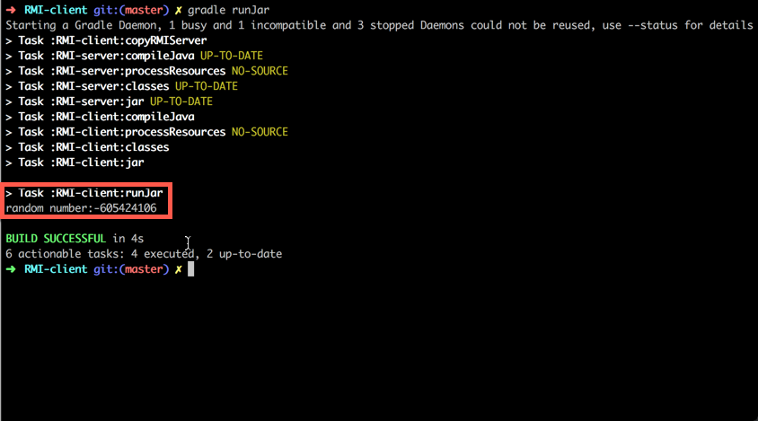

# 一个简单的RMI例子程序
## Usage
### 启动rmiregistry
`rmiregistry -J-Djava.rmi.server.useCodebaseOnly=false`
### 启动服务端程序
`cd RMI-server`

`gradle runJar`
### 启动客户端程序
`cd RMI-client`

`gradle runJar`

**执行结果**：
